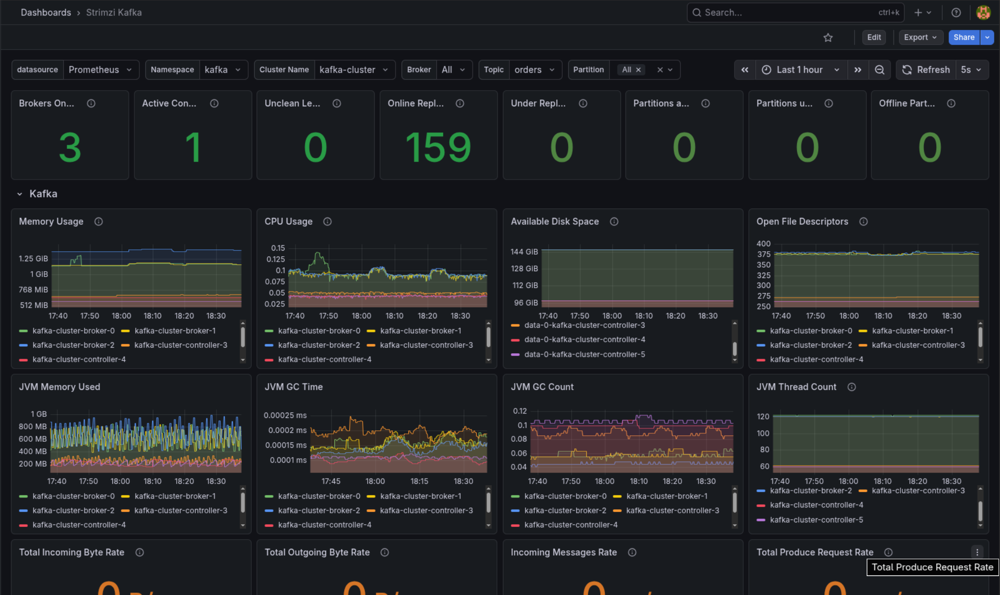

# Kafka Observability

Exemplo de implementação de um cluster **Apache Kafka** no OpenShift usando o operador
[Strimzi](https://strimzi.io/), com aplicações produtor/consumidor, teste de carga e
observabilidade via Grafana.

O objetivo é servir de referência prática: como expor um cluster Kafka com diferentes tipos
de autenticação, conectar aplicações e monitorar tudo.

## Estrutura do projeto

| Pasta | Conteúdo |
|-------|----------|
| [`infra/`](infra/) | Manifestos do cluster Strimzi (cluster, brokers, controllers, users, console, tópicos) |
| [`apps/`](apps/) | Aplicações Quarkus: [`kafka-producer`](apps/kafka-producer/) e [`kafka-consumer`](apps/kafka-consumer/) |
| [`k6/`](k6/) | Teste de carga ([`orders-stress-test.js`](k6/orders-stress-test.js)) |
| [`metrics/`](metrics/) | Monitoramento com Grafana — ver [`metrics/README.md`](metrics/README.md) |

## Como subir o cluster

Aplique os manifestos da pasta [`infra/`](infra/) na ordem numérica:

```shell
oc apply -f infra/ -n kafka
```

Isso cria o cluster (`kafka-cluster`), node pools (broker/controller), os `KafkaUser`,
o console e os tópicos.

## Autenticação (conexão com o Kafka)

O cluster expõe quatro listeners, cada um com um tipo de autenticação
(ver [`infra/1-cluster.yaml`](infra/1-cluster.yaml)):

| Listener   | Tipo       | Porta | TLS | Autenticação    | Acesso |
|------------|------------|-------|-----|-----------------|--------|
| `plain`    | `internal` | 9092  | não | `scram-sha-512` | interno (`.svc`) |
| `tls`      | `internal` | 9093  | sim | `scram-sha-512` | interno (`.svc`) |
| `listener` | `route`    | 9094  | sim | `tls` (mTLS)    | externo (rota) |
| `extscram` | `route`    | 9095  | sim | `scram-sha-512` | externo (rota) |

- **Interno x externo:** listeners `internal` só resolvem pelo DNS do cluster
  (`kafka-cluster-kafka-bootstrap.kafka.svc:<porta>`). Os do tipo `route` são expostos pelo
  router do OpenShift — mas a conexão externa é sempre na **porta 443** (TLS-passthrough),
  não na porta do listener. Pegue o endereço real com:

  ```shell
  oc get kafka kafka-cluster -n kafka \
    -o jsonpath='{range .status.listeners[?(@.name=="extscram")]}{.bootstrapServers}{"\n"}{end}'
  ```

- **`extscram`** é o único listener que permite SCRAM de fora do cluster. Use-o para rodar
  o producer localmente com usuário/senha (`SASL_SSL` + truststore da CA do cluster).

> O **truststore** guarda a CA do cluster e serve para o cliente validar o certificado do
> broker no handshake TLS. A CA do Strimzi é auto-assinada e não está no `cacerts` padrão da
> JVM, então é obrigatória sempre que houver TLS. Só é dispensável no listener `plain`
> (`SASL_PLAINTEXT`, sem criptografia — use apenas em ambiente confiável).

### Configuração do cliente por tipo de `KafkaUser`

O tipo de autenticação do `KafkaUser` precisa bater com o do listener usado. Exemplos com o
prefixo do canal SmallRye (`mp.messaging.outgoing.orders.*`).

**`tls` (mTLS)** — a identidade é o certificado do cliente. Precisa de truststore (validar o
broker) **e** keystore (sua identidade). É o exigido pelo listener `listener` (9094):

```properties
mp.messaging.outgoing.orders.security.protocol=SSL

# Truststore: valida o certificado do broker
mp.messaging.outgoing.orders.ssl.truststore.location=/caminho/ca.p12
mp.messaging.outgoing.orders.ssl.truststore.password=${CA_PASSWORD}
mp.messaging.outgoing.orders.ssl.truststore.type=PKCS12

# Keystore: certificado do usuário (sua identidade)
mp.messaging.outgoing.orders.ssl.keystore.location=/caminho/kafka-user-producer.p12
mp.messaging.outgoing.orders.ssl.keystore.password=${USER_PASSWORD}
mp.messaging.outgoing.orders.ssl.key.password=${USER_PASSWORD}
mp.messaging.outgoing.orders.ssl.keystore.type=PKCS12
```

**`scram-sha-512`** — a identidade é usuário + senha. Não há keystore. Truststore só é
necessário com TLS (`SASL_SSL`); no `plain`/9092 use `SASL_PLAINTEXT` e omita o truststore:

```properties
mp.messaging.outgoing.orders.security.protocol=SASL_SSL
mp.messaging.outgoing.orders.sasl.mechanism=SCRAM-SHA-512
mp.messaging.outgoing.orders.sasl.jaas.config=org.apache.kafka.common.security.scram.ScramLoginModule required username="user-producer" password="${KAFKA_USER_PASSWORD}";

# Truststore: só com TLS (SASL_SSL)
mp.messaging.outgoing.orders.ssl.truststore.location=/caminho/ca.p12
mp.messaging.outgoing.orders.ssl.truststore.password=${CA_PASSWORD}
mp.messaging.outgoing.orders.ssl.truststore.type=PKCS12
```

### Resumo

| Property            | `tls` (mTLS) | `scram-sha-512` |
|---------------------|--------------|-----------------|
| `security.protocol` | `SSL`        | `SASL_SSL` ou `SASL_PLAINTEXT` |
| `sasl.mechanism`    | —            | `SCRAM-SHA-512` |
| `sasl.jaas.config`  | —            | usuário + senha |
| `ssl.truststore.*`  | obrigatório  | só com TLS (`SASL_SSL`) |
| `ssl.keystore.*`    | obrigatório  | não usa |

## Aplicações

Producer e consumer são apps Quarkus em [`apps/`](apps/). Cada uma tem seu próprio README
com instruções de build e execução.

## Observabilidade

O monitoramento do cluster no Grafana (JMX Exporter, PodMonitor, datasource e dashboards)
está documentado em [`metrics/README.md`](metrics/README.md).


